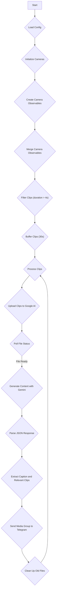

# 🐶 Talky Pet Watcher

_We burn a lot of money on pets. We can spend some more on AI to watch them!_

STATUS: Hardcoded to 1 catte.

## Project Statement

Talky Pet Watcher is a tool to watch a series of ONVIF webcams and their streams. It captures video clips, uploads them to Google AI for processing, and uses a generative model to create captions and identify relevant clips. The results are then delivered to a Telegram channel. This project is designed to help pet owners keep an eye on their pets and share interesting moments with friends.

## Features

-   Monitors multiple ONVIF webcams. (Currently TP-Link TAPO only)
-   Captures video clips and uploads them to Google AI.
-   Uses a generative model (Gemini) to create captions and identify relevant clips.
-   Delivers captioned video clips to a Telegram channel.
-   Cleans up old video files to manage storage.

## Installation

To install and run this project, you will need to have Bun installed. You can find installation instructions at [https://bun.sh/](https://bun.sh/).

1. Clone the repository:

    ```bash
    git clone https://github.com/nelsonjchen/talky-pet-watcher.git
    ```

2. Navigate to the project directory:

    ```bash
    cd talky-pet-watcher
    ```

3. Install dependencies:

    ```bash
    bun install
    ```

    This will install all the necessary packages listed in the `package.json` file.

4. Obtain a Google Cloud API key:

    You will need a Google Cloud API key to use the Google Generative AI services. You can obtain one by following the instructions at [https://ai.google.dev/tutorials/setup](https://ai.google.dev/tutorials/setup).

## Usage

1. **Configuration:**

    Before running the application, you need to configure the ONVIF webcams, Telegram channel, and Google AI settings. This involves setting up the necessary credentials and connection details.

    -   **ONVIF Webcams:** You will need the IP address, username, and password for each ONVIF camera you want to monitor.
        - Currently only TP-Link Tapo Cameras are supported.
    -   **Telegram Channel:** You will need to create a Telegram bot and obtain its API token. You will also need the chat ID of the Telegram channel where you want to receive reports.
    -   **Google AI:** You will need to provide your Google Cloud API key.

    These configuration details should be placed in a `config.ts` file in the root of the project directory. An example configuration file is provided in `config.example.ts`.

    **Generative Model Schema:**

    The application uses a specific schema for interacting with the generative model. Here's the schema used:

    ```typescript
    const schema = {
      description: "Schema for relevant clips and their caption",
      type: SchemaType.OBJECT,
      properties: {
        relevantClips: {
          type: SchemaType.ARRAY,
          items: {
            type: SchemaType.INTEGER,
          },
          description: "Integer indices of relevant clips",
          nullable: false,
        },
        caption: {
          type: SchemaType.STRING,
          description: "Caption for the relevant clips",
          nullable: false,
        },
      },
      required: ["relevantClips", "caption"],
    };
    ```

    The model is instructed to identify relevant clips and generate a caption less than 100 words, using emojis.

2. **Running the Application:**

    Once you have configured the `config.ts` file, you can run the application using the following command:

    ```bash
    bun run index.ts
    ```

    This will start the Talky Pet Watcher, which will begin monitoring the specified ONVIF cameras. It captures video clips, uploads them to Google AI, processes them with the generative model, and sends the captioned video clips to the configured Telegram channel.

## Application Flow

Here's a Mermaid diagram illustrating the flow of the application:



## Typechecking

You can run the TypeScript typechecker without emitting files using:

```bash
bun run typecheck
```

## License

This project is licensed under the MIT License - see the [LICENSE](LICENSE) file for details.
